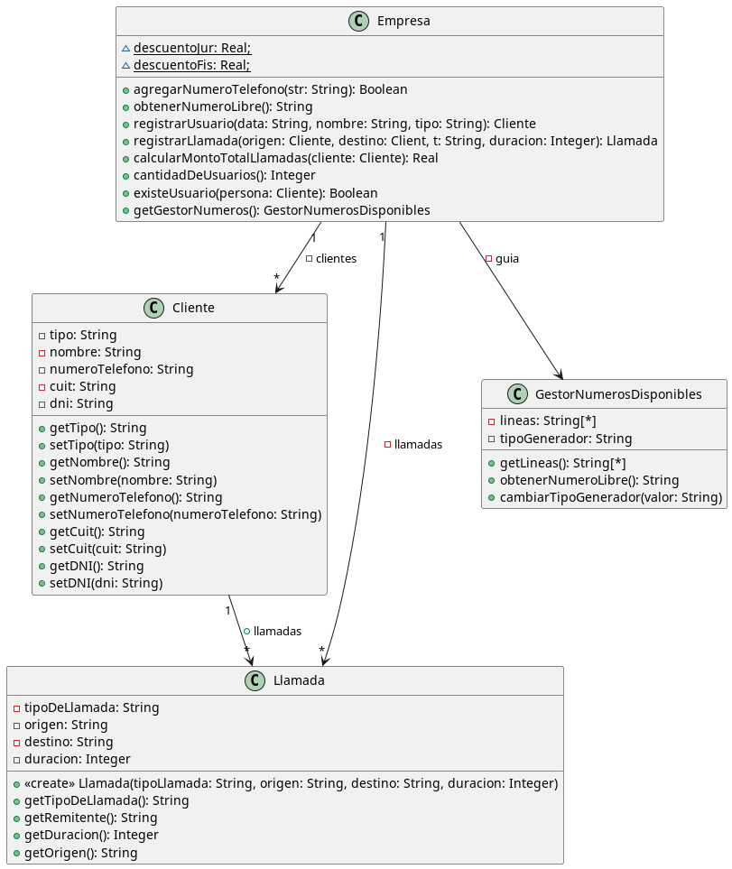
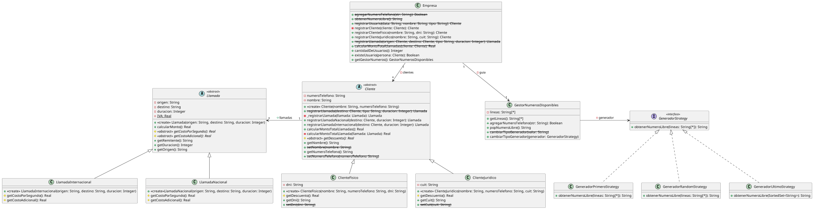

# Ejercicio 3 - Facturación de llamadas

> **Grupo:** Kessler Andrés, Silenzi Manuel

## Enunciado

**Importante:** Aprobando este ejercicio, no será necesario rendir el tema Refactoring en el parcial.

**Fecha límite de entrega:** 24/05/2024 23:59 hs (máximo 2 integrantes por grupo).

En el material adicional encontrará una aplicación que registra y factura llamadas telefónicas. Para lograr tal
objetivo, la aplicación permite administrar números telefónicos, como así también clientes asociados a un número. Los
clientes pueden ser personas físicas o jurídicas. Además, el sistema permite registrar las llamadas realizadas, las
cuales pueden ser nacionales o internacionales. Luego, a partir de las llamadas, la aplicación realiza la facturación,
es decir, calcula el monto que debe abonar cada cliente.

Importe el material adicional provisto por la cátedra y analícelo para identificar y corregir los malos olores que
presenta. En forma iterativa, realice los siguientes pasos:

1. Indique el mal olor.
2. Indique el refactoring que lo corrige.
3. Aplique el refactoring (modifique el código).
4. Asegúrese que los test provistos corran exitosamente.

Si vuelve a encontrar un mal olor, retorne al paso (1.).

Usted debe entregar:

- Un diagrama de clases UML con el diseño inicial de la solución provista.
- La secuencia de refactorings aplicados, documentados cada uno de la siguiente manera:
    - Mal olor detectado en el código.
    - Extracto del código que presenta el mal olor.
    - Refactoring a aplicar que resuelve el mal olor.
    - Código con el refactoring aplicado.
- Un diagrama de clases UML con el diseño final.
- El código Java refactorizado.

**Importante:** asegúrese que no queden malos olores por identificar y refactorizar.

---

## Diagrama UML de la solución original



---

## Refactoring 1

### Mal olor

La clase `Cliente` es una *clase anémica* que solo posee datos y sus getters y setters porque la clase `Empresa`
tiene envidia de atributos y usa sus datos para registrar las llamadas y calcular el monto total de las llamadas.

Esto es un problema porque la clase `Empresa` no cumple con el principio de responsabilidad única y es muy grande, ya
que resuelve cosas de las que no es responsable. Además, la clase `Cliente` provee getters y setters públicos para
todos sus atributos lo que da demasiada visibilidad al resto del programa; esto puede no ser un problema, pero es
conveniente reducir la visibilidad lo máximo posible.

### Extracto del código que presenta el mal olor

```java
public class Cliente {
    public List<Llamada> llamadas = new ArrayList<Llamada>();
    private String tipo;
    private String nombre;
    private String numeroTelefono;
    private String cuit;
    private String dni;

    public String getTipo() {
        return tipo;
    }

    public void setTipo(String tipo) {
        this.tipo = tipo;
    }

    public String getNombre() {
        return nombre;
    }

    public void setNombre(String nombre) {
        this.nombre = nombre;
    }

    // mas getters y setters para los demás atributos
}
```

```java
public class Empresa {
    private List<Cliente> clientes = new ArrayList<Cliente>();
    private List<Llamada> llamadas = new ArrayList<Llamada>();
    private GestorNumerosDisponibles guia = new GestorNumerosDisponibles();

    static double descuentoJur = 0.15;
    static double descuentoFis = 0;

    // ...

    public Llamada registrarLlamada(Cliente origen, Cliente destino, String t, int duracion) {
        Llamada llamada = new Llamada(t, origen.getNumeroTelefono(), destino.getNumeroTelefono(), duracion);
        llamadas.add(llamada);
        origen.llamadas.add(llamada);
        return llamada;
    }

    public double calcularMontoTotalLlamadas(Cliente cliente) {
        double c = 0;
        for (Llamada l : cliente.llamadas) {
            double auxc = 0;
            if (l.getTipoDeLlamada() == "nacional") {
                // el precio es de 3 pesos por segundo más IVA sin adicional por establecer la llamada
                auxc += l.getDuracion() * 3 + (l.getDuracion() * 3 * 0.21);
            } else if (l.getTipoDeLlamada() == "internacional") {
                // el precio es de 150 pesos por segundo más IVA más 50 pesos por establecer la llamada
                auxc += l.getDuracion() * 150 + (l.getDuracion() * 150 * 0.21) + 50;
            }

            if (cliente.getTipo() == "fisica") {
                auxc -= auxc * descuentoFis;
            } else if (cliente.getTipo() == "juridica") {
                auxc -= auxc * descuentoJur;
            }
            c += auxc;
        }
        return c;
    }
}
```

### Refactoring a aplicar que resuelve el mal olor

Vamos a aplicar ***Move Method*** para mover los métodos `registrarLlamada()` y `calcularMontoTotalLLamadas()` desde
la clase `Empresa` a la clase `Cliente`. Para hacer esto también será necesario mover las variables de clase
`descuentoJur` y `descuentoFis` a la clase `Cliente`, lo cual es lógico porque los descuentos son específicos del
tipo de cliente.

Mantendremos los métodos en la clase `Empresa` para evitar modificar la interfaz de dicha clase, pero estos métodos
ahora delegarán su tarea en los nuevos métodos de la clase `Cliente`.

Además, aprovechando que estamos modificando estos métodos, vamos a aplicar ***Rename Field*** para renombrar al
parámetro `t` por `tipo`, ya que consideramos que es más descriptivo.

Finalmente, marcaremos al método `calcularMontoTotalLlamadas()` como obsoleto (*deprecated*), puesto que consideramos
que es preferible utilizar este método directamente desde el cliente. No lo borramos, aplicando ***Remove Middle Man***,
para evitar modificar la interfaz de la clase `Cliente` y los test; sin embargo, al marcarlo como obsoleto, dejamos el
terreno preparado para hacerlo fácilmente en un futuro.

### Código con el refactoring aplicado

```java
public class Cliente {
    // Variables de instancia...

    static double descuentoJur = 0.15;
    static double descuentoFis = 0;

    public Llamada registrarLlamada(Cliente destino, String tipo, int duracion) {
        Llamada llamada = new Llamada(tipo, this.getNumeroTelefono(), destino.getNumeroTelefono(), duracion);
        this.llamadas.add(llamada);
        return llamada;
    }

    public double calcularMontoTotalLlamadas() {
        double c = 0;
        for (Llamada l : this.llamadas) {
            double auxc = 0;
            if (l.getTipoDeLlamada() == "nacional") {
                // el precio es de 3 pesos por segundo más IVA sin adicional por establecer la llamada
                auxc += l.getDuracion() * 3 + (l.getDuracion() * 3 * 0.21);
            } else if (l.getTipoDeLlamada() == "internacional") {
                // el precio es de 150 pesos por segundo más IVA más 50 pesos por establecer la llamada
                auxc += l.getDuracion() * 150 + (l.getDuracion() * 150 * 0.21) + 50;
            }

            if (this.getTipo() == "fisica") {
                auxc -= auxc * descuentoFis;
            } else if (this.getTipo() == "juridica") {
                auxc -= auxc * descuentoJur;
            }
            c += auxc;
        }
        return c;
    }

    // Getters y setters...
}
```

```java
public class Empresa {
    private List<Cliente> clientes = new ArrayList<Cliente>();
    private List<Llamada> llamadas = new ArrayList<Llamada>();
    private GestorNumerosDisponibles guia = new GestorNumerosDisponibles();

    // ...

    public Llamada registrarLlamada(Cliente origen, Cliente destino, String tipo, int duracion) {
        Llamada llamada = origen.registrarLlamada(destino, tipo, duracion);
        llamadas.add(llamada);
        return llamada;
    }

    @Deprecated
    public double calcularMontoTotalLlamadas(Cliente cliente) {
        return cliente.calcularMontoTotalLlamadas();
    }

    // ...
}
```

---

## Refactoring 2

### Mal olor

La variable de instancia `llamadas` en la clase `Empresa` no tiene mucho sentido. Cada cliente ya conoce todas
sus llamadas, y tiene sentido que así sea. Esta variable de instancia no solo genera duplicación de información,
sino que además sus valores no se utilizan, solo agregamos las llamadas a la lista, pero luego no utilizamos esta
información para procesar nada.

### Extracto del código que presenta el mal olor

```java
public class Empresa {
    private List<Cliente> clientes = new ArrayList<Cliente>();
    private List<Llamada> llamadas = new ArrayList<Llamada>();
    private GestorNumerosDisponibles guia = new GestorNumerosDisponibles();

    public Llamada registrarLlamada(Cliente origen, Cliente destino, String tipo, int duracion) {
        Llamada llamada = origen.registrarLlamada(destino, tipo, duracion);
        llamadas.add(llamada);  // Único uso de la variable de instancia `llamadas`
        return llamada;
    }
    // Otros métodos...
}

```

### Refactoring a aplicar que resuelve el mal olor

Vamos a eliminar la variable de instancia `llamadas` de la clase `Empresa`. Al hacer esto tenemos que modificar el
método `registrarLlamada()`, que ahora únicamente delegará su tarea en el cliente de origen; por ello, siguiendo con el
mismo criterio que en el refactoring anterior, marcaremos a este método como obsoleto.

### Código con el refactoring aplicado

```java
public class Empresa {
    private List<Cliente> clientes = new ArrayList<Cliente>();
    private GestorNumerosDisponibles guia = new GestorNumerosDisponibles();

    @Deprecated
    public Llamada registrarLlamada(Cliente origen, Cliente destino, String tipo, int duracion) {
        return origen.registrarLlamada(destino, tipo, duracion);
    }
    // Otros métodos...
}
```

---

## Refactoring 3

### Mal olor

El método `calcularMontoTotalLlamadas()` de la clase `Cliente` es un *método largo* que realiza varias tareas. Se
encarga de recorrer todas las llamadas del cliente y, para cada llamada, calcula el costo y el descuento que se debe
aplicar.

Además, el recorrido de la lista de llamadas se hace utilizando un for-each y consideramos es mejor utilizar *streams*,
ya que se mejora la legibilidad y no tenemos que andar reinventando la rueda.

### Extracto del código que presenta el mal olor

```java
public class Cliente {
    // ...
    public double calcularMontoTotalLlamadas() {
        double c = 0;
        for (Llamada l : this.llamadas) {
            double auxc = 0;
            if (l.getTipoDeLlamada() == "nacional") {
                // el precio es de 3 pesos por segundo más IVA sin adicional por establecer la llamada
                auxc += l.getDuracion() * 3 + (l.getDuracion() * 3 * 0.21);
            } else if (l.getTipoDeLlamada() == "internacional") {
                // el precio es de 150 pesos por segundo más IVA más 50 pesos por establecer la llamada
                auxc += l.getDuracion() * 150 + (l.getDuracion() * 150 * 0.21) + 50;
            }

            if (this.getTipo() == "fisica") {
                auxc -= auxc * descuentoFis;
            } else if (this.getTipo() == "juridica") {
                auxc -= auxc * descuentoJur;
            }
            c += auxc;
        }
        return c;
    }
    // ...
}
```

### Refactoring a aplicar que resuelve el mal olor

Para mejorar este método vamos a aplicar varios cambios.

Primero vamos a aplicar ***Extract Method*** para separar el recorrido de la lista de la operación a aplicar sobre
cada elemento. Para ello, vamos a crear un nuevo método `calcularMontoTotalLlamada()` que se encargará de calcular
el monto de cada llamada de forma individual.

Luego utilizaremos ***Substitute Algorithm*** para simplificar ligeramente la lógica que se utiliza para calcular
los montos.

Después vamos a utilizar ***Extract Method*** nuevamente en el nuevo método para crear dos métodos más:
`calcularMontoLlamada()`, que se encargará de calcular el monto de una llamada, y `aplicarDescuento()`, que se
encargará de calcular el monto con el que se debe aplicar.

Finalmente, emplearemos ***Replace Loop with Pipeline*** para deshacernos del bucle for-each.

### Código con el refactoring aplicado

```java
public class Cliente {
    // ...
    public double calcularMontoTotalLlamadas() {
        return this.llamadas.stream().mapToDouble(this::calcularMontoTotalLlamada).sum();
    }

    private double calcularMontoTotalLlamada(Llamada l) {
        return aplicarDescuento(calcularMontoLlamada(l));
    }

    private double calcularMontoLlamada(Llamada l) {
        if (l.getTipoDeLlamada() == "nacional") {
            // el precio es de 3 pesos por segundo más IVA sin adicional por establecer la llamada
            return l.getDuracion() * 3 * 1.21;
        } else if (l.getTipoDeLlamada() == "internacional") {
            // el precio es de 150 pesos por segundo más IVA más 50 pesos por establecer la llamada
            return l.getDuracion() * 150 * 1.21 + 50;
        }
        return 0;
    }

    private double aplicarDescuento(double monto) {
        if (this.getTipo() == "fisica") {
            return monto * (1 - descuentoFis);
        } else if (this.getTipo() == "juridica") {
            return monto * (1 - descuentoJur);
        }
        return monto;
    }
    // ...
}
```

---

## Refactoring 4

### Mal olor

Ahora que extrajimos el cálculo del costo de una llamada al método `calcularMontoLlamada()` podemos ver claramente
que la clase `Cliente` tiene envidia de atributos de la clase Llamada. Esto es un problema porque la clase `Cliente`
se encarga de hacer cosas (calcular el costo de una llamada) que deberían ser responsabilidad de la clase `Llamada`.
Además, actualmente nuestra clase `Llamada` está anémica, ya que no tiene ninguna responsabilidad.

### Extracto del código que presenta el mal olor

```java
public class Cliente {
    // ...
    private double calcularMontoTotalLlamada(Llamada l) {
        return aplicarDescuento(calcularMontoLlamada(l));
    }

    private double calcularMontoLlamada(Llamada l) {
        if (l.getTipoDeLlamada() == "nacional") {
            // el precio es de 3 pesos por segundo más IVA sin adicional por establecer la llamada
            return l.getDuracion() * 3 * 1.21;
        } else if (l.getTipoDeLlamada() == "internacional") {
            // el precio es de 150 pesos por segundo más IVA más 50 pesos por establecer la llamada
            return l.getDuracion() * 150 * 1.21 + 50;
        }
        return 0;
    }
    // ...
}
```

### Refactoring a aplicar que resuelve el mal olor

Para resolver este mal olor aplicaremos ***Move Method*** para mover el método `calcularMontoLlamada()` desde la
clase `Cliente` a la clase `Llamada` y después renombraremos el método a `calcularMonto()` y mejoramos los nombres
de los parámetros.

### Código con el refactoring aplicado

```java
public class Cliente {
    // ...
    private double calcularMontoTotalLlamada(Llamada llamada) {
        return aplicarDescuento(llamada.calcularMonto());
    }
    // ...
}
```

```java
public class Llamada {
    // ...
    public double calcularMonto() {
        if (this.getTipoDeLlamada() == "nacional") {
            // el precio es de 3 pesos por segundo más IVA sin adicional por establecer la llamada
            return this.getDuracion() * 3 * 1.21;
        }
        if (this.getTipoDeLlamada() == "internacional") {
            // el precio es de 150 pesos por segundo más IVA más 50 pesos por establecer la llamada
            return this.getDuracion() * 150 * 1.21 + 50;
        }
        return 0;
    }
}
//...
```

---

## Refactoring 5

### Mal olor

En el método `calcularMonto()` de la clase `Llamada` utilizamos un `if` que pregunta por un tipo para determinar la
forma en la que calculamos el monto. Esto es un problema porque no se aprovecha el polimorfismo y hace más compleja
a la clase `Llamada`.

### Extracto del código que presenta el mal olor

```java
public class Llamada {
    private String tipoDeLlamada;

    // ...
    public double calcularMonto() {
        if (this.getTipoDeLlamada() == "nacional") {
            // el precio es de 3 pesos por segundo más IVA sin adicional por establecer la llamada
            return this.getDuracion() * 3 * 1.21;
        }
        if (this.getTipoDeLlamada() == "internacional") {
            // el precio es de 150 pesos por segundo más IVA más 50 pesos por establecer la llamada
            return this.getDuracion() * 150 * 1.21 + 50;
        }
        return 0;
    }

    // ...
    public String getTipoDeLlamada() {
        return tipoDeLlamada;
    }
}

```

### Refactoring a aplicar que resuelve el mal olor

Para resolver este mal olor aplicaremos ***Replace Conditional with Polymorphism***. Transformaremos la clase `Llamada`
en una clase abstracta de la que extienden dos nuevas subclases: `LlamadaNacional` y `LlamadaInternacional`.
Luego haremos que el método `calcularMonto()` sea abstracto para que cada una de las subclases lo implemente de
acuerdo a lo que necesita.

Al realizar estos cambios ya no podremos instanciar a `Llamada`, puesto que es una clase abstracta. Para solucionar
esto añadiremos tres métodos a la clase `Cliente`:

- `_registrarLlamada()`: un método privado que se encargará de manejar la lógica de registrar una llamada.
- `registrarLlamadaNacional()`: un método público que se encargará de crear una llamada nacional y se la pasará a
  `_registrarLlamada()` para que la registre.
- `registrarLlamadaInternacional()`: un método público que se encargará de crear una llamada internacional y se la
  pasará a `_registrarLlamada()` para que la registre.

Finalmente, modificaremos al método `registrarLlamada()` para que se encargue de llamar a `registrarLlamadaNacional()`
o `registrarLlamadaInternacional()` según corresponda. Marcaremos este método como *obsoleto* porque consideramos
que es preferible utilizar alguno de los nuevos métodos, pero no lo borramos porque no queremos modificar la interfaz
de la clase `Cliente`.

### Código con el refactoring aplicado

```java
public abstract class Llamada {
    private String origen;
    private String destino;
    private int duracion;

    public Llamada(String origen, String destino, int duracion) {
        this.origen = origen;
        this.destino = destino;
        this.duracion = duracion;
    }

    public abstract double calcularMonto();

    // Getters y setters (sin getTipoDeLlamada())
}
```

```java
public class LlamadaNacional extends Llamada {
    public LlamadaNacional(String origen, String destino, int duracion) {
        super(origen, destino, duracion);
    }

    @Override
    public double calcularMonto() {
        // el precio es de 3 pesos por segundo más IVA sin adicional por establecer la llamada
        return this.getDuracion() * 3 * 1.21;
    }
}
```

```java
public class LlamadaInternacional extends Llamada {
    public LlamadaInternacional(String origen, String destino, int duracion) {
        super(origen, destino, duracion);
    }

    @Override
    public double calcularMonto() {
        // el precio es de 150 pesos por segundo más IVA más 50 pesos por establecer la llamada
        return this.getDuracion() * 150 * 1.21 + 50;
    }
}
```

```java
public class Cliente {
    // Atributos...

    @Deprecated
    public Llamada registrarLlamada(Cliente destino, String tipo, int duracion) {
        switch (tipo) {
            case "nacional":
                return this.registrarLlamadaNacional(destino, duracion);
            case "internacional":
                return this.registrarLlamadaInternacional(destino, duracion);
            default:
                throw new IllegalArgumentException(tipo + " no es un tipo válido");
        }
    }

    private Llamada _registrarLlamada(Llamada llamada) {
        this.llamadas.add(llamada);
        return llamada;
    }

    public Llamada registrarLlamadaNacional(Cliente destino, int duracion) {
        return this._registrarLlamada(
                new LlamadaNacional(this.getNumeroTelefono(), destino.getNumeroTelefono(), duracion));
    }

    public Llamada registrarLlamadaInternacional(Cliente destino, int duracion) {
        return this._registrarLlamada(
                new LlamadaInternacional(this.getNumeroTelefono(), destino.getNumeroTelefono(), duracion));
    }

    // Otros métodos
}
```

---

## Refactoring 6

### Mal olor

Las implementaciones al método `calcularMonto()` de `Llamada` realizan la misma serie de pasos. Podemos pensar el
cálculo del monto como una receta formada por duración * precio por segundo (3 para las nacionales y 150 para las
internacionales) + IVA + costo adicional (0 para las llamadas nacionales y 50 para las internacionales). Además,
estos métodos están llenos de *números mágicos* que atentan contra la legibilidad del código.

### Extracto del código que presenta el mal olor

```java
public class LlamadaInternacional extends Llamada {
    // ...
    @Override
    public double calcularMonto() {
        // el precio es de 150 pesos por segundo más IVA más 50 pesos por establecer la llamada
        return this.getDuracion() * 150 * 1.21 + 50;
    }
}
```

```java
public class LlamadaNacional extends Llamada {
    // ...
    @Override
    public double calcularMonto() {
        // el precio es de 3 pesos por segundo más IVA sin adicional por establecer la llamada
        return this.getDuracion() * 3 * 1.21;
    }
}
```

### Refactoring a aplicar que resuelve el mal olor

Aplicaremos ***Form Template Method***, para ello haremos que el método `calcularMonto()` en la clase `Llamada` deje
de ser abstracta e implemente los pasos abstractos utilizando los métodos abstractos y protegidos `getCostoPorSegundo()`
y `getCostoAdicional()`, que deberán ser implementados por las subclases. Además, siguiendo ***Replace Magic
Literal***, definiremos una constante simbólica para reemplazar el número mágico del IVA.

### Código con el refactoring aplicado

```java
public abstract class Llamada {
    // Atributos...

    private static final double IVA = 0.21;

    public Llamada(String origen, String destino, int duracion) {
        this.origen = origen;
        this.destino = destino;
        this.duracion = duracion;
    }

    public double calcularMonto() {
        return this.getDuracion() * this.getCostoPorSegundo() * (1 + IVA) + this.getCostoAdicional();
    }

    protected abstract double getCostoPorSegundo();

    protected abstract double getCostoAdicional();

    // Getters y setters...
}
```

```java
public class LlamadaNacional extends Llamada {
    public LlamadaNacional(String origen, String destino, int duracion) {
        super(origen, destino, duracion);
    }

    @Override
    protected double getCostoPorSegundo() {
        return 3;
    }

    @Override
    protected double getCostoAdicional() {
        return 0;
    }
}
```

```java
public class LlamadaInternacional extends Llamada {
    public LlamadaInternacional(String origen, String destino, int duracion) {
        super(origen, destino, duracion);
    }

    @Override
    protected double getCostoPorSegundo() {
        return 150;
    }

    @Override
    protected double getCostoAdicional() {
        return 50;
    }
}
```

---

## Refactoring 7

### Mal olor

La clase `Cliente` no posee un constructor. Esto es un problema porque no se define claramente que datos son
necesarios al momento de crear un cliente, lo que podría llevar a la creación de objetos con datos inválidos (por
ejemplo, un cliente sin nombre). Además, Java ya provee los constructores para la creación de objetos, por lo que no
estamos aprovechando las herramientas que nos brinda el lenguaje. Finalmene, un atributo debería ser establecido en la
creación y nunca alterarse. Al proveer un setter se indica que ese atributo podría cambiar y se rompe el
encapsulamiento.

### Extracto del código que presenta el mal olor

```java
public class Cliente {
    public List<Llamada> llamadas = new ArrayList<Llamada>();
    private String tipo;
    private String nombre;
    private String numeroTelefono;
    private String cuit;
    private String dni;

    // Otros métodos y getters...

    public void setTipo(String tipo) {
        this.tipo = tipo;
    }

    public void setNombre(String nombre) {
        this.nombre = nombre;
    }

    public void setNumeroTelefono(String numeroTelefono) {
        this.numeroTelefono = numeroTelefono;
    }

    public void setCuit(String cuit) {
        this.cuit = cuit;
    }

    public void setDNI(String dni) {
        this.dni = dni;
    }
}
```

```java
public class Empresa {
    // ...
    public Cliente registrarUsuario(String data, String nombre, String tipo) {
        Cliente var = new Cliente();
        if (tipo.equals("fisica")) {
            var.setNombre(nombre);
            String tel = this.obtenerNumeroLibre();
            var.setTipo(tipo);
            var.setNumeroTelefono(tel);
            var.setDNI(data);
        } else if (tipo.equals("juridica")) {
            String tel = this.obtenerNumeroLibre();
            var.setNombre(nombre);
            var.setTipo(tipo);
            var.setNumeroTelefono(tel);
            var.setCuit(data);
        }
        clientes.add(var);
        return var;
    }
    // ...
}
```

### Refactoring a aplicar que resuelve el mal olor

Para resolver este mal olor aplicaremos la técnica ***Remove Setting Method***. Primero implementaremos un
constructor dentro de la clase `Cliente` para establecer todos los valores necesarios y moveremos la inicialización
de la lista `llamadas` al constructor. Luego, marcaremos todos los setters como *obsoletos*, ya que consideramos
que no son necesarios. No los borraremos para no alterar la interfaz de la clase. Finalmente, en la clase `Empresa`,
dentro del método `registrarUsuario()`, usaremos el constructor previamente mencionado asignándole `null` a los
atributos que no utiliza.

También aplicaremos ***Consolidate Duplicate Conditional Fragments*** para eliminar el código repetido en el if-else.
Moveremos la variable `tel` antes del if-else.

### Código con el refactoring aplicado

```java
public class Cliente {
    public List<Llamada> llamadas;
    private String tipo;
    private String nombre;
    private String numeroTelefono;
    private String cuit;
    private String dni;

    static double descuentoJur = 0.15;
    static double descuentoFis = 0;

    public Cliente(String tipo, String nombre, String numeroTelefono, String cuit, String dni) {
        this.tipo = tipo;
        this.nombre = nombre;
        this.numeroTelefono = numeroTelefono;
        this.cuit = cuit;
        this.dni = dni;
        this.llamadas = new ArrayList<>();
    }

    // Otros métodos y getters...

    @Deprecated
    public void setTipo(String tipo) {
        this.tipo = tipo;
    }

    @Deprecated
    public void setNombre(String nombre) {
        this.nombre = nombre;
    }

    @Deprecated
    public void setNumeroTelefono(String numeroTelefono) {
        this.numeroTelefono = numeroTelefono;
    }

    @Deprecated
    public void setCuit(String cuit) {
        this.cuit = cuit;
    }

    @Deprecated
    public void setDNI(String dni) {
        this.dni = dni;
    }
}
```

```java
public class Empresa {
    // ...
    public Cliente registrarUsuario(String data, String nombre, String tipo) {
        Cliente var = null;
        String tel = this.obtenerNumeroLibre();
        if (tipo.equals("fisica")) {
            var = new Cliente(nombre, tipo, tel, null, data);
        } else if (tipo.equals("juridica")) {
            var = new Cliente(nombre, tipo, tel, data, null);
        }
        clientes.add(var);
        return var;
    }
    // ...
}
```

---

## Refactoring 8

### Mal olor

En el método `aplicarDescuento()` de la clase `Cliente` utilizamos un `if` para determinar el descuento a aplicar
según el tipo de cliente. Esto es un problema porque no se aprovecha el polimorfismo.

### Extracto del código que presenta el mal olor

```java
public class Cliente {
    // ...
    private double aplicarDescuento(double monto) {
        if (this.getTipo() == "fisica") {
            return monto * (1 - descuentoFis);
        } else if (this.getTipo() == "juridica") {
            return monto * (1 - descuentoJur);
        }
        return monto;
    }
    // ...
}
```

### Refactoring a aplicar que resuelve el mal olor

Para resolver este mal olor aplicaremos ***Replace Conditional with Polymorphism***, siguiendo una metodología muy
similar a la utilizada en el refactoring 5. Primero haremos que la clase `Cliente` sea abstracta y que de ella
extiendan dos nuevas clases (una para cada tipo) `ClienteFisico` y `ClienteJuridico`. Luego, haremos que el método
`aplicarDescuento()` sea abstracto y que cada una de las subclases lo implemente de acuerdo a sus necesidades.

Al igual que ocurrió en el refactoring 5, al realizar estos cambios ya no podremos instanciar a `Cliente`, por lo
que tendremos que modificar al método `registrarUsuario()` de la clase `Empresa`. Crearemos tres métodos nuevos:

- `registrarCliente()`: para manejar la lógica de registrar un usuario.
- `registrarClienteFisico()`: para crear un usuario físico y después pasárselo a `registrarCliente()`.
- `registrarClienteJuridico()`: para crear un usuario jurídico y después pasárselo a `registrarCliente()`.

Finalmente, modificaremos al método `registrarUsuario()` de la clase `Empresa` para que se encargue de llamar al
método `registrarClienteFisico()` o `registrarClienteJuridico()` según corresponda y marcaremos a este método como
*obsoleto*, ya que es preferible utilizar alguno de los métodos nuevos, pero no lo borramos porque no queremos
modificar la interfaz de la clase `Empresa`.

Cambiamos la palabra usuario por cliente porque es más clara (modifican una lista llamada `clientes`).

### Código con el refactoring aplicado

```java
public abstract class Cliente {
    public List<Llamada> llamadas;
    private String nombre;
    private String numeroTelefono;
    private String cuit;
    private String dni;

    static double descuentoJur = 0.15;
    static double descuentoFis = 0;

    public Cliente(String nombre, String numeroTelefono, String cuit, String dni) {
        this.nombre = nombre;
        this.numeroTelefono = numeroTelefono;
        this.cuit = cuit;
        this.dni = dni;
        this.llamadas = new ArrayList<>();
    }

    protected abstract double aplicarDescuento(double monto);
    // ...
}
```

```java
public class ClienteJuridico extends Cliente {
    public ClienteJuridico(String nombre, String numeroTelefono, String cuit) {
        super(nombre, numeroTelefono, cuit, null);
    }

    @Override
    protected double aplicarDescuento(double monto) {
        return monto * (1 - Cliente.descuentoJur);
    }
}
```

```java
public class ClienteFisico extends Cliente {
    public ClienteFisico(String nombre, String numeroTelefono, String dni) {
        super(nombre, numeroTelefono, null, dni);
    }

    @Override
    protected double aplicarDescuento(double monto) {
        return monto * (1 - Cliente.descuentoFis);
    }
}
```

```java
public class Empresa {
    // ...
    @Deprecated
    public Cliente registrarUsuario(String data, String nombre, String tipo) {
        switch (tipo) {
            case "fisica":
                return this.registrarClienteFisico(nombre, data);
            case "juridica":
                return this.registrarClienteJuridico(nombre, data);
            default:
                throw new IllegalArgumentException(tipo + " no es un tipo válido");
        }
    }

    private Cliente registrarCliente(Cliente cliente) {
        this.clientes.add(cliente);
        return cliente;
    }

    public Cliente registrarClienteFisico(String nombre, String dni) {
        return this.registrarCliente(new ClienteFisico(nombre, this.obtenerNumeroLibre(), dni));
    }

    public Cliente registrarClienteJuridico(String nombre, String cuit) {
        return this.registrarCliente(new ClienteJuridico(nombre, this.obtenerNumeroLibre(), cuit));
    }
    // ...
}
```

---

## Refactoring 9

### Mal olor

La clase `Cliente` cuenta con campos que son usados solo por algunas de las subclases. La variable de instancia
`dni` y la variable de clase `descuentoFis` son utilizadas únicamente por la clase `ClienteFisico`, mientras que la
variable de instancia `cuit` y la variable de clase `descuentoJur` son utilizadas únicamente por la
clase `ClienteJuridico`.

Esto es un problema porque tenemos clases que cuentan con información que no utilizan, lo que implica que no se está
aplicando el polimorfismo de forma correcta.

### Extracto del código que presenta el mal olor

```java
public abstract class Cliente {
    public List<Llamada> llamadas;
    private String nombre;
    private String numeroTelefono;
    private String cuit;
    private String dni;

    static double descuentoJur = 0.15;
    static double descuentoFis = 0;

    // ...
}
```

```java
public class ClienteJuridico extends Cliente {
    public ClienteJuridico(String nombre, String numeroTelefono, String cuit) {
        super(nombre, numeroTelefono, cuit, null);
    }
}
```

```java
public class ClienteFisico extends Cliente {
    public ClienteFisico(String nombre, String numeroTelefono, String dni) {
        super(nombre, numeroTelefono, null, dni);
    }
}
```

### Refactoring a aplicar que resuelve el mal olor

Para resolver este problema aplicaremos ***Push Down Field***. Eliminaremos los atributos `dni`, `cuit`,
`descuentoFis` y `descuentoJur` de la clase `Cliente` y los moveremos a las subclases que le corresponden.

Al hacer esto, tendremos que modificar los constructores de la clase `Cliente`, `ClienteJuridico` y `ClienteFisico`.

Además, tendremos que aplicar ***Push Down Method*** a los getters y setters de las variables que movimos
previamente (moveremos los setters aunque estén deprecados para mantener la interfaz).

Por último, cambiaremos la invocación de las variables estáticas dentro de los métodos `aplicarDescuento()` en cada
subclase.

### Código con el refactoring aplicado

```java
public abstract class Cliente {
    public List<Llamada> llamadas;
    private String nombre;
    private String numeroTelefono;

    public Cliente(String nombre, String numeroTelefono) {
        this.nombre = nombre;
        this.numeroTelefono = numeroTelefono;
        this.llamadas = new ArrayList<>();
    }
    //...
}
```

```java
public class ClienteFisico extends Cliente {
    private String dni;
    static double descuentoFis = 0;

    public ClienteFisico(String nombre, String numeroTelefono, String dni) {
        super(nombre, numeroTelefono);
        this.dni = dni;
    }

    @Override
    protected double aplicarDescuento(double monto) {
        return monto * (1 - descuentoFis);
    }

    public String getDni() {
        return this.dni;
    }

    @Deprecated
    public void setDni(String dni) {
        this.dni = dni;
    }
    //...
}
```

```java
public class ClienteJuridico extends Cliente {
    private String cuit;
    static double descuentoJur = 0.15;

    public ClienteJuridico(String nombre, String numeroTelefono, String cuit) {
        super(nombre, numeroTelefono);
        this.cuit = cuit;
    }

    @Override
    protected double aplicarDescuento(double monto) {
        return monto * (1 - descuentoJur);
    }

    public String getCuit() {
        return this.cuit;
    }

    @Deprecated
    public void setCuit(String cuit) {
        this.cuit = cuit;
    }

    //...
}
```

---

## Refactoring 10

### Mal olor

El método `aplicarDescuento()` dentro de las subclases `ClienteFisico` y `ClienteJuridico` es muy similar, con la única
diferencia en los atributos estáticos que usa. Tenemos código duplicado.

### Extracto del código que presenta el mal olor

```java
public class Cliente {
    // ...
    protected abstract double aplicarDescuento(double monto);
    // ...
}
```

```java
public class ClienteJuridico extends Cliente {
    // ...
    static double descuentoJur = 0.15;
    // ...

    @Override
    protected double aplicarDescuento(double monto) {
        return monto * (1 - descuentoJur);
    }
}
```

```java
public class ClienteFisico extends Cliente {
    // ...
    static double descuentoFis = 0;
    // ...


    @Override
    protected double aplicarDescuento(double monto) {
        return monto * (1 - descuentoFis);
    }
}
```

### Refactoring a aplicar que resuelve el mal olor

Para solucionar esto, aplicaremos la técnica de ***Form Template Method***. Moveremos el método `aplicarDescuento()`
(en este caso la receta) a la superclase `Cliente` con la diferencia de que donde antes iría el atributo
`descuentoFis` o `descuentoJur` ahora usaremos un nuevo método llamado `getDescuento()`. Este método será abstracto en
la clase `Cliente`, pero retornará el valor de `descuentoFis` y `descuentoJur` una vez lo definamos en las subclases
`ClienteFisico` y `ClienteJuridico` respectivamente.

Una vez hecho este cambio podremos aplicar ***Remove Dead Code*** para sacar los atributos estáticos, puesto que no los
utilizamos.

### Código con el refactoring aplicado

```java
public class Cliente {
    protected double aplicarDescuento(double monto) {
        return monto * (1 - this.getDescuento());
    }

    protected abstract double getDescuento();
}
```

```java
public class ClienteJuridico extends Cliente {
    @Override
    protected double getDescuento() {
        return 0.15;
    }
}
```

```java
public class ClienteFisico extends Cliente {
    @Override
    protected double getDescuento() {
        return 0;
    }
}
```

---

## Refactoring 11

### Mal olor

Luego de hacer el refactoring anterior surge un nuevo olor, es aparente que el método `calcularMontoTotalLlamada()` es
un ***Middle Man*** del método `aplicarDescuento()`. Actualmente, solo hace una llamada al método `aplicarDescuento()`
causando un nivel de indirección innecesario, haciendo que se pierda entre toda la delegación.

### Extracto del código que presenta el mal olor

```java
public class Cliente {
    // ...
    private double calcularMontoTotalLlamada(Llamada llamada) {
        return aplicarDescuento(llamada.calcularMonto());
    }

    protected double aplicarDescuento(double monto) {
        return monto * (1 - this.getDescuento());
    }
    // ...
}
```

### Refactoring a aplicar que resuelve el mal olor

Como el método `aplicarDescuento()` es demasiado sencillo, en lugar de eliminar al intermediario
(`calcularMontoTotalLlamada()`), aplicaremos el refactoring ***Inline Method*** y eliminaremos a `aplicarDescuento()`
moviendo su funcionalidad al método `calcularMontoTotalLlamada()`.

### Código con el refactoring aplicado

```java
public class Cliente {
    private double calcularMontoTotalLlamada(Llamada llamada) {
        return llamada.calcularMonto() * (1 - this.getDescuento());
    }
}

```

---

## Refactoring 12

### Mal olor

En la clase `GestorNumerosDisponibles`, dentro del método `obtenerNumeroLibre()`, hay código repetido (en todos los
casos remueve la línea y luego la retorna).

### Extracto del código que presenta el mal olor

```java
public class GestorNumerosDisponibles {
    // ...
    public String obtenerNumeroLibre() {
        String linea;
        switch (tipoGenerador) {
            case "ultimo":
                linea = lineas.last();
                lineas.remove(linea);
                return linea;
            case "primero":
                linea = lineas.first();
                lineas.remove(linea);
                return linea;
            case "random":
                linea = new ArrayList<String>(lineas).get(new Random().nextInt(lineas.size()));
                lineas.remove(linea);
                return linea;
        }
        return null;
    }
    // ...
}
```

### Refactoring a aplicar que resuelve el mal olor

Para eliminar el código repetido aplicaremos ***Consolidate Duplicate Conditional Fragments***. Moveremos el código
común a los distintos casos luego del `switch` y pondremos el `return null` como el caso por defecto,
haciendo un early return en caso de que el tipo definido no sea correcto.

### Código con el refactoring aplicado

```java
public class GestorNumerosDisponibles {
    // ...
    public String obtenerNumeroLibre() {
        String linea;
        switch (tipoGenerador) {
            case "ultimo":
                linea = lineas.last();
                break;
            case "primero":
                linea = lineas.first();
                break;
            case "random":
                linea = new ArrayList<String>(lineas).get(new Random().nextInt(lineas.size()));
                break;
            default:
                return null;
        }
        this.lineas.remove(linea);
        return linea;
    }
    // ...
}
```

---

## Refactoring 13

### Mal olor

En la clase `GestorNumerosDisponibles` seguimos teniendo un ***Switch Statement*** definiendo el comportamiento del
método `obtenerNumeroLibre()` según el tipo del generador.

### Extracto del código que presenta el mal olor

```java
public class GestorNumerosDisponibles {
    // ...
    public String obtenerNumeroLibre() {
        String linea;
        switch (tipoGenerador) {
            case "ultimo":
                linea = lineas.last();
                break;
            case "primero":
                linea = lineas.first();
                break;
            case "random":
                linea = new ArrayList<String>(lineas).get(new Random().nextInt(lineas.size()));
                break;
            default:
                return null;
        }
        this.lineas.remove(linea);
        return linea;
    }
    // ...
}
```

### Refactoring a aplicar que resuelve el mal olor

Para resolver este mal olor utilizaremos ***Replace Conditional Logic with Strategy***. Crearemos una interfaz llamada
`GeneradorStrategy` con un método `obtenerNumeroLibre()`, que será implementado por las clases
`GeneradorPrimeroStrategy`, `GeneradorUltimoStrategy` y `GeneradorRandomStrategy`, con el comportamiento que le
corresponda.

Luego, cambiamos el atributo `tipoGenerador` para ser un objeto `GeneradorStrategy`. Ademàs, modificamos el método
`cambiarTipoGenerador()` para asignarle a `tipoGenerador` un objeto de la clase correspondiente según el parámetro
recibido. Sin embargo, consideramos que esta no es la mejor forma de asignar un strategy así que lo marcamos como
*obsoleto* y sobrecargamos al método `cambiarTipoGenerador()` para que reciba un nuevo strategy.

### Código con el refactoring aplicado

```java
public class GestorNumerosDisponibles {
    private SortedSet<String> lineas = new TreeSet<String>();
    private GeneradorStrategy tipoGenerador = new GeneradorUltimoStrategy();


    public SortedSet<String> getLineas() {
        return lineas;
    }

    public String obtenerNumeroLibre() {
        String linea = tipoGenerador.obtenerNumeroLibre(this.lineas);
        this.lineas.remove(linea);
        return linea;
    }

    @Deprecated
    public void cambiarTipoGenerador(String valor) {
        switch (valor) {
            case "ultimo":
                this.tipoGenerador = new GeneradorUltimoStrategy();
                break;
            case "primero":
                this.tipoGenerador = new GeneradorPrimeroStrategy();
                break;
            case "random":
                this.tipoGenerador = new GeneradorRandomStrategy();
                break;
        }
    }

    public void cambiarTipoGenerador(GeneradorStrategy tipoGenerador) {
        this.tipoGenerador = tipoGenerador;
    }
}
```

```java
public interface GeneradorStrategy {
    String obtenerNumeroLibre(SortedSet<String> lineas);
}
```

```java
public class GeneradorUltimoStrategy implements GeneradorStrategy {
    @Override
    public String obtenerNumeroLibre(SortedSet<String> lineas) {
        return lineas.last();
    }
}
```

```java
public class GeneradorPrimeroStrategy implements GeneradorStrategy {
    @Override
    public String obtenerNumeroLibre(SortedSet<String> lineas) {
        return lineas.first();
    }
}
```

```java
public class GeneradorRandomStrategy implements GeneradorStrategy {
    @Override
    public String obtenerNumeroLibre(SortedSet<String> lineas) {
        return new ArrayList<String>(lineas).get(new Random().nextInt(lineas.size()));
    }
}
```

---

## Refactoring 14

### Mal olor

Al realizar el anterior refactoring el nombre del atributo `tipoGenerador` pierde sentido.

### Extracto del código que presenta el mal olor

```java
public class GestorNumerosDisponibles {
    private SortedSet<String> lineas = new TreeSet<String>();
    private GeneradorStrategy tipoGenerador = new GeneradorUltimoStrategy();


    public SortedSet<String> getLineas() {
        return lineas;
    }

    public String obtenerNumeroLibre() {
        String linea = tipoGenerador.obtenerNumeroLibre(this.lineas);
        this.lineas.remove(linea);
        return linea;
    }

    @Deprecated
    public void cambiarTipoGenerador(String valor) {
        switch (valor) {
            case "ultimo":
                this.tipoGenerador = new GeneradorUltimoStrategy();
                break;
            case "primero":
                this.tipoGenerador = new GeneradorPrimeroStrategy();
                break;
            case "random":
                this.tipoGenerador = new GeneradorRandomStrategy();
                break;
        }
    }

    public void cambiarTipoGenerador(GeneradorStrategy tipoGenerador) {
        this.tipoGenerador = tipoGenerador;
    }
}
```

### Refactoring a aplicar que resuelve el mal olor

Aplicamos el refactoring ***Rename Field*** y renombramos al atributo `tipoGenerador` como `generador`.

### Código con el refactoring aplicado

```java
public class GestorNumerosDisponibles {
    private SortedSet<String> lineas = new TreeSet<String>();
    private GeneradorStrategy generador = new GeneradorUltimoStrategy();


    public SortedSet<String> getLineas() {
        return lineas;
    }

    public String obtenerNumeroLibre() {
        String linea = generador.obtenerNumeroLibre(this.lineas);
        this.lineas.remove(linea);
        return linea;
    }

    @Deprecated
    public void cambiarTipoGenerador(String valor) {
        switch (valor) {
            case "ultimo":
                this.generador = new GeneradorUltimoStrategy();
                break;
            case "primero":
                this.generador = new GeneradorPrimeroStrategy();
                break;
            case "random":
                this.generador = new GeneradorRandomStrategy();
                break;
        }
    }

    public void cambiarTipoGenerador(GeneradorStrategy generador) {
        this.generador = generador;
    }
}
```

---

## Refactoring 15

### Mal olor

El nombre del método `obtenerNumeroLibre()` de la clase `GenstorNumerosDisponibles` es poco descriptivo, ya que no solo
devuelve un número libre sino que también lo elimina de la colección de números disponibles.

### Extracto del código que presenta el mal olor

```java
public class GestorNumerosDisponibles {
    //...
    public String obtenerNumeroLibre() {
        String linea = generador.obtenerNumeroLibre(this.lineas);
        this.lineas.remove(linea);
        return linea;
    }
    //...
}
```

### Refactoring a aplicar que resuelve el mal olor

Aplicamos el refactoring ***Rename Field*** y renombramos el método `obtenerNumeroLibre()` como `popNumeroLibre()`,
haciendo referencia a la operación `pop()` de muchas colecciones.

### Código con el refactoring aplicado

```java
public class GestorNumerosDisponibles {
    //...
    public String popNumeroLibre() {
        String linea = generador.obtenerNumeroLibre(this.lineas);
        this.lineas.remove(linea);
        return linea;
    }
    //...
}
```

```java
public class Empresa {
    // ...
    public String obtenerNumeroLibre() {
        return guia.popNumeroLibre();
    }
    // ...
}
```

---

## Refactoring 16

### Mal olor

El método `obtenerNumeroLibre()` de la clase `Empresa` es un ***Middle Man*** del método `popNumeroLibre()`. Esto es un
problema porque incrementa innecesariamente la cantidad de métodos que posee la clase.

### Extracto del código que presenta el mal olor

```java
public class Empresa {
    // ...
    public String obtenerNumeroLibre() {
        return guia.popNumeroLibre();
    }
    // ...
}
```

### Refactoring a aplicar que resuelve el mal olor

Para resolver esto aplicaremos ***Remove Middle Man***, que implicará remover el método `obtenerNumeroLibre()` de la
clase `Empresa` y cambiar los llamados a este método para usar directamente el método `popNumeroLibre()` de la
clase `GestorNumerosDisponibles`

En lugar de eliminar el método `obtenerNumeroLibre()` lo marcamos como obsoleto para no modificar la interfaz de la
clase.

### Código con el refactoring aplicado

```java
public class Empresa {
    // ...
    @Deprecated
    public String obtenerNumeroLibre() {
        return guia.popNumeroLibre();
    }

    // ...

    public Cliente registrarClienteFisico(String nombre, String dni) {
        return this.registrarCliente(new ClienteFisico(nombre, this.guia.popNumeroLibre(), dni));
    }

    public Cliente registrarClienteJuridico(String nombre, String cuit) {
        return this.registrarCliente(new ClienteJuridico(nombre, this.guia.popNumeroLibre(), cuit));
    }
    // ...
}
```

---

## Refactoring 17

### Mal olor

En el método `agregarNumeroTelefono()` de la clase `Empresa` hay envidia de atributos, usa los atributos de la clase
`GeneradorNumerosDisponibles`. Esto reduce la encapsulación y aumenta el acoplamiento entre dichas clases.

### Extracto del código que presenta el mal olor

```java
public class Empresa {
    //...
    public boolean agregarNumeroTelefono(String str) {
        boolean encontre = guia.getLineas().contains(str);
        if (!encontre) {
            guia.getLineas().add(str);
            encontre = true;
            return encontre;
        } else {
            encontre = false;
            return encontre;
        }
    }
    //...
}
```

### Refactoring a aplicar que resuelve el mal olor

Para resolverlo usaremos ***Move Method***. Moveremos el método `agregarNumeroTelefono()` desde la clase `Empresa` a la
clase `GestorNumerosDisponibles`, reemplazando el método original por una llamada al método nuevo.

Lo ideal sería remover completamente el método de la clase `Empresa`, pero simplemente lo marcaremos como *obsoleto*
para mantener la interfaz usada originalmente.

### Código con el refactoring aplicado

```java
public class Empresa {
    //...
    @Deprecated
    public boolean agregarNumeroTelefono(String str) {
        return guia.agregarNumeroTelefono(str);
    }
    //...
}
```

```java
public class GestorNumerosDisponibles {
    //...
    public boolean agregarNumeroTelefono(String str) {
        boolean encontre = this.lineas.contains(str);
        if (!encontre) {
            this.lineas.add(str);
            encontre = true;
            return encontre;
        } else {
            encontre = false;
            return encontre;
        }
    }
    //...
}
```

---

## Refactoring 18

### Mal olor

Dentro del método `agregarNumeroTelefono()` de la clase `GestorNumerosDisponibles` estamos ***Reinventando la Rueda***.
La colección de lineas es un `SortedSet` y el método `add()` de esta clase ya devuelve *false* y no agrega al elemento
cuando este ya está en la colección.

### Extracto del código que presenta el mal olor

```java
public class GestorNumerosDisponibles {
    private SortedSet<String> lineas = new TreeSet<String>();

    //...

    public boolean agregarNumeroTelefono(String str) {
        boolean encontre = this.lineas.contains(str);
        if (!encontre) {
            this.lineas.add(str);
            encontre = true;
            return encontre;
        } else {
            encontre = false;
            return encontre;
        }
    }
    //...
}
```

### Refactoring a aplicar que resuelve el mal olor

Para solucionar este problema, haremos un ***Substitute Algorithm***. Reemplazaremos todo el código del método para
que simplemente devuelva el resultado de intentar agregar el elemento a la colección.

### Código con el refactoring aplicado

```java
public class GestorNumerosDisponibles {
    private SortedSet<String> lineas = new TreeSet<String>();

    //...

    public boolean agregarNumeroTelefono(String str) {
        return this.lineas.add(str);
    }
    //...
}
```

---

## Diagrama UML de la solución final



---

## Eliminando obsoletos de los tests

Para verificar que todos los cambios que hicimos funcionen correctamente eliminamos todos los métodos obsoletos de los
tests y volvimos a ejecutarlos.

Estos cambios los dejamos en el archivo EmpresaV2Test

```java
class EmpresaV2Test {
    Empresa sistema;

    @BeforeEach
    public void setUp() {
        this.sistema = new Empresa();
        this.sistema.getGestorNumeros().agregarNumeroTelefono("2214444554");
        this.sistema.getGestorNumeros().agregarNumeroTelefono("2214444555");
        this.sistema.getGestorNumeros().agregarNumeroTelefono("2214444556");
        this.sistema.getGestorNumeros().agregarNumeroTelefono("2214444557");
        this.sistema.getGestorNumeros().agregarNumeroTelefono("2214444558");
        this.sistema.getGestorNumeros().agregarNumeroTelefono("2214444559");
    }

    @Test
    void testcalcularMontoTotalLlamadas() {
        Cliente emisorPersonaFisca = sistema.registrarClienteFisico("Brendan Eich", "11555666");
        Cliente remitentePersonaFisica = sistema.registrarClienteFisico("Doug Lea", "00000001");
        Cliente emisorPersonaJuridica = sistema.registrarClienteJuridico("Nvidia Corp", "17555222");
        Cliente remitentePersonaJuridica = sistema.registrarClienteJuridico("Sun Microsystems", "25765432");

        emisorPersonaJuridica.registrarLlamadaNacional(remitentePersonaFisica, 10);
        emisorPersonaJuridica.registrarLlamadaInternacional(remitentePersonaFisica, 8);
        emisorPersonaJuridica.registrarLlamadaNacional(remitentePersonaJuridica, 5);
        emisorPersonaJuridica.registrarLlamadaInternacional(remitentePersonaJuridica, 7);

        emisorPersonaFisca.registrarLlamadaNacional(remitentePersonaFisica, 15);
        emisorPersonaFisca.registrarLlamadaInternacional(remitentePersonaFisica, 45);
        emisorPersonaFisca.registrarLlamadaNacional(remitentePersonaJuridica, 13);
        emisorPersonaFisca.registrarLlamadaInternacional(remitentePersonaJuridica, 17);

        assertEquals(11454.64, emisorPersonaFisca.calcularMontoTotalLlamadas(), 0.01);
        assertEquals(2445.40, emisorPersonaJuridica.calcularMontoTotalLlamadas(), 0.01);
        assertEquals(0, remitentePersonaFisica.calcularMontoTotalLlamadas());
        assertEquals(0, remitentePersonaJuridica.calcularMontoTotalLlamadas());
    }

    @Test
    void testAgregarUsuario() {
        assertEquals(this.sistema.cantidadDeUsuarios(), 0);
        this.sistema.getGestorNumeros().agregarNumeroTelefono("2214444558");
        Cliente nuevaPersona = this.sistema.registrarClienteFisico("Alan Turing", "2444555");

        assertEquals(1, this.sistema.cantidadDeUsuarios());
        assertTrue(this.sistema.existeUsuario(nuevaPersona));
    }

    @Test
    void obtenerNumeroLibre() {
        // por defecto es el ultimo
        assertEquals("2214444559", this.sistema.getGestorNumeros().popNumeroLibre());

        this.sistema.getGestorNumeros().cambiarTipoGenerador(new GeneradorPrimeroStrategy());
        assertEquals("2214444554", this.sistema.getGestorNumeros().popNumeroLibre());

        this.sistema.getGestorNumeros().cambiarTipoGenerador(new GeneradorRandomStrategy());
        assertNotNull(this.sistema.getGestorNumeros().popNumeroLibre());
    }
}
```
